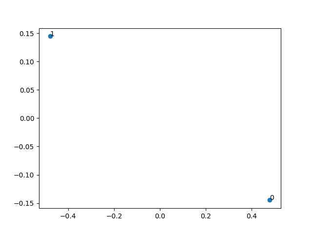

# Text Mining Reflection

## Project Overview
    The topic I would like to discover in this project is that I would like to see how people would write the Wikipedia page for companies in a certain industry. Thus, I use the MediaWiki package to search Wikipedia and get information related to Blizzard Entertainment. I analyzed the word frequency through using the re, regular expression, operation,  identified the popular words, and compared the similarity between the description for Blizzard and another company, Take-Two Interactive.

## Implementation
- **Data Structure and Major Components**:
    - Since all the information are from a web page and I cannot directly process them as a string, I first use `Blizzard = wikipedia.page("Blizzard Entertainment").content ` to grab all the content and convert all the words to lower cases. I then defined a pattern `out = re.sub(r"[^\w\s]", "", text_1)` to clean the data.
    - After processing all the content, I count the total words, unique words, and most common words to get a basic understanding of the text on Blizzard's page.
    - As I hope to compare the similarity between the description for Blizzard and another company and understand some common characteristic in their history and description, I then define functions that would show all the duplicated words in both texts, calculate the similarity, and draw the MDS to visualize the similarity in a two-dimensional space.
- **A Design Decision**:
    - When I first started cleaning all the data, I was choosing between using `pattern=re.findall(r'\b[a-z]{3.20}\b',text_1)` and the current `filter_word = ["the", "of","to","and","in","a", "an","is","was","for","by","from","on","as","with",]` as the filter. My main goal is to eliminate some meaningless words like a and an; however, on the one hand, setting the pattern will remove all these words from the beginning, which means the count of total words and unique word would be inaccurate; on the other hand, this would potential removing some meaningful words. Thus, I decided to set a filter word list manually to eliminate some effects from the meaningless conjunctions.

## Results
- Based on the return result, it seems that people wrote 4,476 words to illustrate the history of the company. The Wikipedia page includes a lot of information like release date and information related to popular words "warcraft", "starcraft", and "players", which makes sense as this is a video game company's Wiki page.
- The comparison between Blizzard and Take-Two Interactive is also very interesting. It seems that people like to discuss/ think their studios and development process is important. Both firms had significant changes in 1996 and 1998 as these two years were mentioned 2 and 6 times on Blizzard's page and 3 and 2 times on Take-Two's page. It also seems that both firms start to/the editors on Wiki think they have started to build their esports business as this is also a duplicated word shown on their Wiki page.
- 
- Furthermore, based on the clustering graph, although Blizzard and Take-Two Interactive are two companies that run different types of video games, their background information share some similarities as editors would discuss similar topics.

## Reflection

- I think overall I achieved my goal of analyzing one Wikipedia page and do a comparison to see some shared important information between two firms in the same industry. Potentially I could include more data points in this test (i.e. include 5 companies and test their similarity or test whether they also have the keyword, esports, to check the trend of esports). I could also extend my data source from Wikipedia to the company's actual website (and this would require an advanced web crawler technique to grab information from multiple websites and multiple pages) to gather more accurate/company's opinion.
- I wish I could have more knowledge regarding `re.sub` and `re.findall` before starting this project. Thus, I do not have to spend a lot of time researching the correct way to design and utilize the pattern and to clean all the data. I also hope that I would have more time to set up more web pages and discover their similarity.
- I did not partner with other people this time because first I was sick last week and I could not promise that I can commit to working at that time and I did not want to delay other people's progress. Secondly, I wanted to go through the text analysis project by myself to ensure that I understand how to use/apply list, tuple, and dictionary. So I worked with myself I think that worked well. 